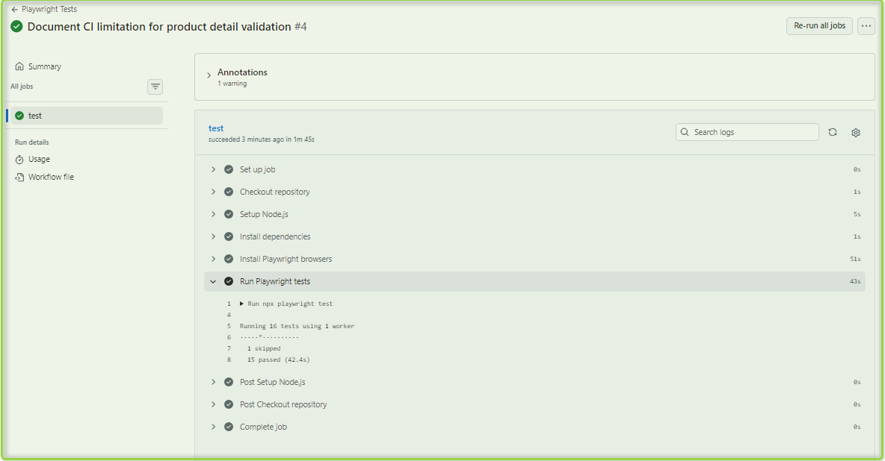

# Webshop Automation Suite

## Overview

This project is a UI automation test suite built with Playwright and TypeScript against the Practice Software Testing application.

The goal of the project was to design maintainable end-to-end tests that validate key product overview functionality while demonstrating good automation practices such as accessible locators, synchronization strategies, and business-focused assertions.

## Application Under Test

Practice Software Testing Website

## User Story Reference:

Practice Software Testing – Product Overview User Story
https://testsmith-io.github.io/practice-software-testing/#/user-stories/v5?id=product-overview

## Tech Stack

- Playwright
- TypeScript
- Node.js
- Git
- GitHub
- GitHub Actions

## CI/CD

This project includes a GitHub Actions workflow that automatically executes the Playwright test suite when code is pushed to the repository or when a pull request is created.

The workflow:

- Checks out the repository
- Installs project dependencies
- Installs Playwright browsers
- Runs the Playwright test suite

This helps verify that changes do not introduce regressions and provides automated feedback on every update.

### Example Successful Workflow Run



## CI Environment Note

One product-detail validation test is excluded from GitHub Actions execution.

During investigation, the test was found to pass consistently in a local environment but fail on GitHub-hosted runners because the Practice Software Testing website serves an anti-bot protection page ("Just a moment...") instead of the product detail page.

The test remains part of the project and is executed locally. It is skipped only in the CI environment to prevent false failures caused by external website restrictions rather than application defects.

## Features Covered

### Product Grid Rendering (AC1)

- Product grid is displayed
- Product cards are rendered
- Each card contains:
  Product image
  Product name
  Product price

### Product Navigation (AC2)

- Product cards navigate to the correct product details page
- Product information is displayed after navigation

### Pagination (AC3)

- Pagination controls are displayed
- Initial pagination state is correct
- Product results change when navigating between pages
- Active page indicator updates correctly

### Search (AC4)

- Search returns only matching products
- Search resets active filters

### Category Filtering (AC5)

- Category filters update visible products
- Multiple filters can be combined
- Removing a filter restores the original product list
- Selected filters remain active during pagination

### Hierarchical Categories (AC6)

- Selecting a parent category automatically selects all child categories

## Key Challenges Solved

### Reliable Synchronization After UI Updates

- The application performs asynchronous rerendering after filtering and search operations. The test suite uses Playwright retrying assertions instead of fixed waits to synchronize with UI updates.

### Avoiding Hardcoded Test Data

- Tests validate business behavior rather than relying on specific product counts or product ordering.

### Dataset Validation Instead of Example Validation

- Where possible, tests validate the entire returned dataset instead of checking a single example product.

### Examples include:

- Validating all search results contain the search term
- Validating all products returned by a category filter belong to the selected category

## Accessibility-Oriented Locator Strategy

Tests primarily use: getByRole() & getByLabel() to keep locators user-facing and maintainable.

## Project Structure

```text
.github/
└── workflows/
    └── playwright.yml

tests/
└── product-overview/
    ├── grid.spec.ts
    ├── navigation.spec.ts
    ├── pagination.spec.ts
    ├── search.spec.ts
    └── filtering.spec.ts

helpers/
└── homepage-navigation.ts
```

## Running The Tests

- Install dependencies: npm install
- Run all tests: npx playwright test
- Open the HTML report: npx playwright show-report

## Author

Created as part of a QA Automation portfolio demonstrating UI test automation, test design, and QA engineering practices using Playwright and TypeScript.
